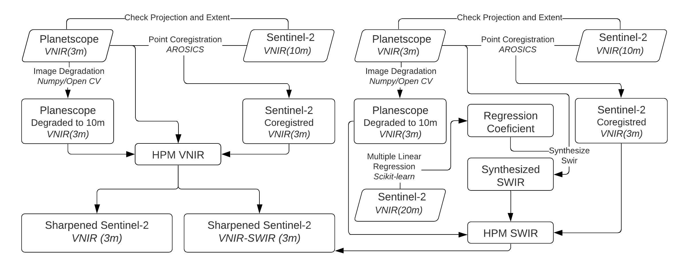

# Sharpening Sentinel-2 with Planetscope
## Synopsis
Image fusion, also called image sharpening or multisensory merging, has been developed to get the best of both spectral and spatial resolution by integrating different image sources to improve the information and quality of multispectral images. Satellites with no Pan band can use other satellites’ high-resolution bands to emulate a Pan band, provided the pixel resolution and the sharpening algorithm are suited to the specific process. For example, to take advantage of Planetscope’s four finest spectral resolution bands, Li et al. (2020) tested methods to combine spectrally-corrected Sentinel-2 imagery with high-resolution but uncorrected Planetscope-0 imagery for Earth Observation studies. 

In this repository we provide the automated and slightly changed version for the RGB-NIR sharpening and SWIR-1(2) sythesizing routine proposed by Li et al. (2020). This is a significant upgrade that makes it possible to easily and quickly sharpen many images or time series and removes the human factor, which can introduce error. The algorithm workflow is presented in the diagram below.



All the details and tests are described in the article ------ .

## Repository Structure
```
Sharpening-S2_Planetscope
│── README.md
│── requirements.txt
├── code/
│   ├── __init__.py
│   ├── classification.py
│   ├── main.py
│   └── uniqueList.py
├── tests/
│   ├── ###img1/
│   ├── ###img2/
│   └── ###imgn/
└── data/
│   ├── img1/
│   ├── img2/
│  

```

## How to cite
Tayer et al 2022......

## Tutorial


## Supported Formats


## Dependencies

```


```

## References

Li, Z.; Zhang, H.K.; Roy, D.P.; Yan, L.; Huang, H. Sharpening the Sentinel-2 10 and 20 m Bands to Planetscope-0 3 m Resolution. Remote Sens. 2020, 12, 2406. https://doi.org/10.3390/rs12152406
